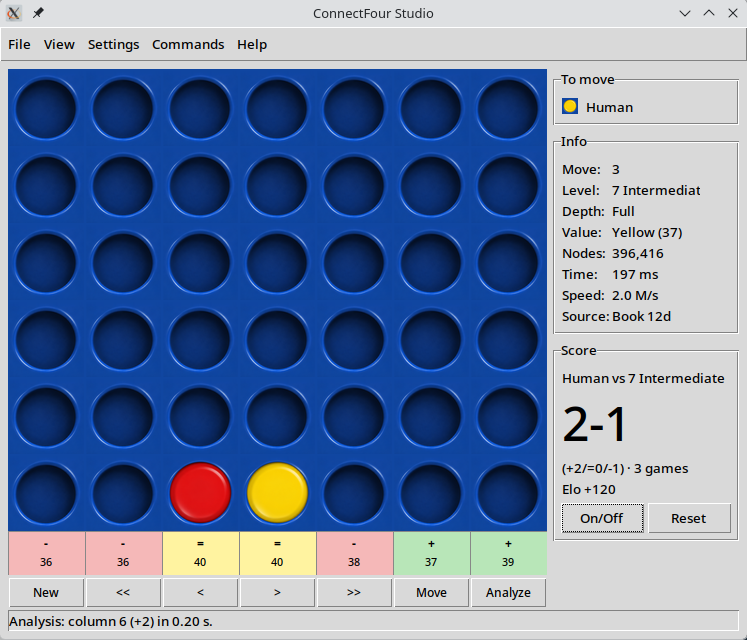

# ConnectFour Studio

*Open-source Connect Four with 15 levels, 20 boards, tournament mode, match statistics and perfect real-time analysis.*



A free, offline desktop program for Connect Four — play against the computer,
analyze positions, and run engine-vs-engine matches.

- **Engine:** BitBully by Markus Thill (Python module `bitbully`, C++ core)
- **GUI:** Python + Tkinter (+ Pillow)
- **License:** GNU AGPL v3 — source code freely available

## Features

- 14 computer levels (1 Random … 14 Perfect) + 0 Loser joke level + 2 custom user levels with own (p, s, w)
- Live evaluation: winner + stones to the end, nodes, time, book/computed source
- Modes: Human-Computer, 2 players, Computer-Computer playout, Computer-Computer match
- 20 stone sets (mouse wheel / PageUp-PageDown to browse)
- Session score vs. the engine, quicksave, random positions, help in 6 languages (German, English, French, Spanish, Dutch, Italian)

## Install & Start

[⬇ Download for Linux (AppImage, no install needed)](https://github.com/Patrick-Ric/connectfour-studio/releases/latest)

Make it executable and start it:

```bash
chmod +x ConnectFour_Studio-x86_64.AppImage
./ConnectFour_Studio-x86_64.AppImage
```

Requires glibc ≥ 2.28 (Ubuntu 20.04+, Debian 10+, Fedora 29+); install
libfuse2 if needed.

Or install from source. Requires 64-bit Python 3.10–3.14 **with Tkinter**
(`bitbully` ships wheels for CPython 3.10–3.14 on 64-bit Windows/Linux;
other platforms need a C++ build from source).

- **Windows:** the python.org installer includes Tkinter by default —
  keep `tcl/tk and IDLE` checked during installation. No extra step needed.
- **Linux:** Tkinter is often a separate package. Quick check:
  `python3 -c "import tkinter"`. If that fails:
  `sudo apt install python3-tk` (Debian/Ubuntu/Mint),
  `sudo dnf install python3-tkinter` (Fedora),
  `sudo pacman -S tk` (Arch).

Linux/macOS:

```bash
python3 -m venv .venv
.venv/bin/pip install -r requirements.txt
.venv/bin/python connectfour_studio.py
```

Windows (PowerShell or cmd):

```bat
py -m venv .venv
.venv\Scripts\pip install -r requirements.txt
.venv\Scripts\python connectfour_studio.py
```

## Keyboard

- `1-7` play column, `Arrow Left/Right` undo/redo, `Arrow Up/Down` first/last move
- `PageUp/PageDown` or mouse wheel over the board browse stone sets
- `F1` help, `F3/F4` quick save/load, `F5` engine move, `F6` evaluate all moves, `F7` permanent analysis

## Project layout

- `connectfour_studio.py` — main window, board, menus, threads
- `cfs_help.py` — help + info dialogs (`HELP_CONTENT`, DE/EN/FR/ES/NL/IT)
- `cfs_sets.py` — stone sets (`data/images/set1..set20`)
- `cfs_levels.py` — levels, match, score, random dialog
- `cfs_lang.py` — UI strings (`STRINGS`, DE/EN/FR/ES/NL/IT)

## Credits

- Engine: **BitBully by Markus Thill** — https://markusthill.github.io/projects/0_bitbully/
- Opening book: `bitbully-databases` (`12-ply-dist`)
